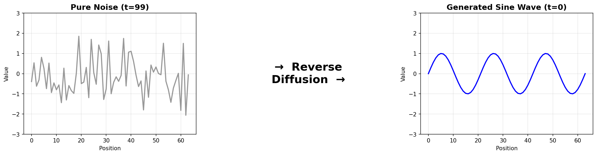
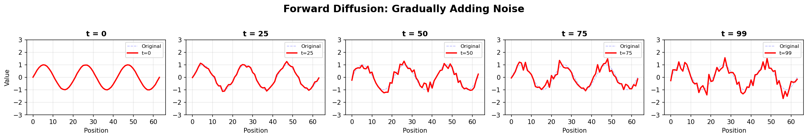
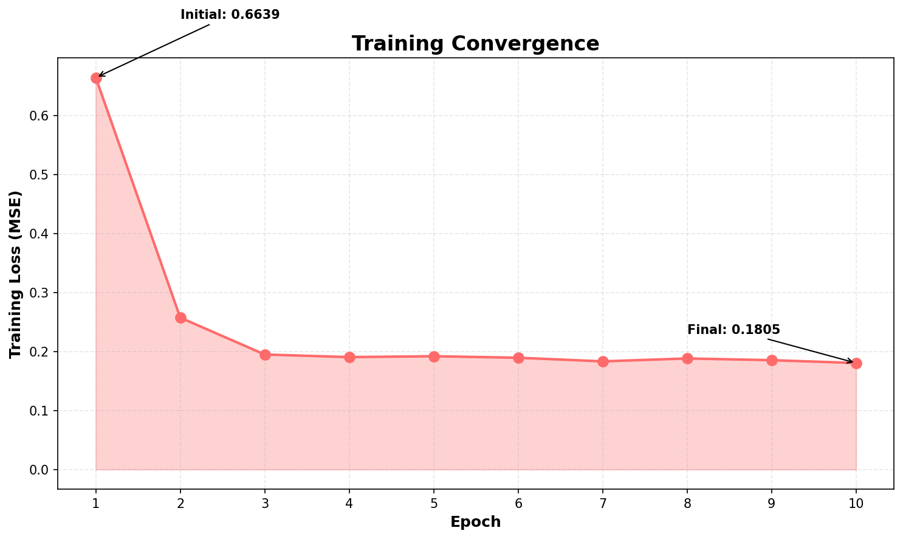
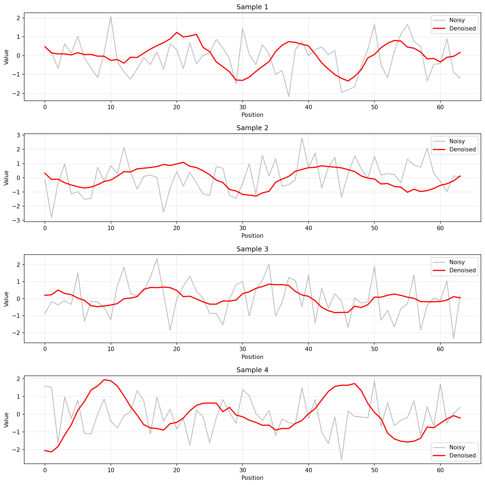

# 🌊 1D Diffusion: Teaching AI to Un-Screw Up Noise

> **TL;DR:** Built a complete diffusion model from scratch. It turns random garbage into beautiful sine waves. Magic? Nah, just math and PyTorch.



**Status:** ✅ Actually works | 🚀 Trains in 2 mins | 🧠 Teaches you diffusion models

---

## 🤔 Wait, What Even Is This?

You know how you can "enhance" blurry images in movies? (Total BS, btw)

Well, diffusion models actually do something cooler: **create things from pure noise**.

This project teaches you how by starting simple - turning random static into smooth sine waves.

### The Magic Trick

```
Random Noise 😵 → [Model does 100 magic steps] → Perfect Sine Wave ✨
```



Watch how we **destroy** a perfectly good sine wave by adding noise (training), then **reverse** it to generate new ones!

---

## 🎯 Why Should I Care?

**This is literally how Stable Diffusion, Midjourney, and DALL-E work.** Just with images instead of 1D signals.

Learn it here first where it's:
- ⚡ Fast (2 min training on CPU)
- 👀 Easy to visualize (simple plots, not scary tensors)
- 🧠 Actually understandable (no PhD required)

Then go build the next DALL-E 4. I believe in you! 🚀

---

## 🏗️ How It Works (The Actual Magic)

### Step 1: Destroy Everything 💥
Take clean sine waves → add noise gradually → get pure chaos

```python
clean_wave + gaussian_noise = total_garbage
```

### Step 2: Train a Psychic Neural Network 🔮
Teach it to predict: *"What noise was added?"*

```python
if model.can_predict_noise():
    model.can_remove_noise()  # big brain time
```

### Step 3: Generate Like a Boss 😎
Start with pure noise → ask model to remove noise 100 times → profit!

```python
x = random_noise()
for _ in range(100):
    x = model.denoise(x)  # slowly becoming beautiful
return x  # chef's kiss 👌
```

---

## 🚀 Quick Start (Just Do It™)

```bash
# Install stuff
pip install torch numpy matplotlib pyyaml

# Run everything
python main.py

# That's it. Seriously.
```

**What happens:**
1. ⏰ Trains for 2 minutes
2. 💾 Saves model to `outputs/`
3. 🎨 Generates 16 new sine waves
4. 📊 Shows you a pretty plot

Check `outputs/sampled_sequences.png` to see your AI's artwork!

---

## 📊 Actual Results (Receipts Included)



**Loss goes down = Model learns = We're cooking! 🔥**

Initial: 0.66 → Final: 0.18 (that's a 73% improvement, if you're into stats)

**Generated samples:**


Look at those smooth bois! 😍

---

## ⚙️ Customize It (Config Go Brrrr)

Edit `config.py`:

```python
@dataclass
class DiffusionConfig:
    num_epochs: int = 10        # More epochs = better (but slower)
    timesteps: int = 100         # More steps = smoother results
    batch_size: int = 64         # GPU go brrr? Increase this
    device: str = "cuda"         # Got GPU? Use it!
```

**Pro tips:**
- 🐢 CPU only? Set `device = "cpu"` and `batch_size = 32`
- 🏎️ Want it faster? Set `timesteps = 50` and `num_epochs = 5`
- 🎨 Want better quality? Set `timesteps = 1000` and `num_epochs = 50`

---

## 📂 Project Files (What's What)

```
diffusion-1d/
├── main.py           → Press play here 🎮
├── config.py         → Tweak knobs here 🎛️
├── model.py          → The brain 🧠
├── diffusion.py      → The magic ✨
├── train.py          → The learning 📚
├── data.py           → Sine wave factory 🏭
├── utils.py          → Helper stuff 🔧
└── sampling.py       → Generation station 🎨
```

**Files ranked by importance:**
1. `main.py` - Start here
2. `diffusion.py` - Where magic happens
3. `model.py` - The actual AI
4. Everything else - Supporting cast

---

## 🧠 The Secret Sauce (For Nerds)

<details>
<summary><b>🔥 Click if you want the actual math</b></summary>

### Forward Diffusion (Breaking Stuff)

```python
x_t = √(α̅_t) · x_0 + √(1-α̅_t) · ε
```

Translation: Mix clean data with noise based on timestep `t`

### Reverse Diffusion (Fixing Stuff)

```python
x_{t-1} = (x_t - β_t · ε_θ(x_t,t) / √(1-α̅_t)) / √(α_t) + σ_t · z
```

Translation: Predict noise, subtract it, repeat 100 times

### Training (Teaching the AI)

```python
loss = MSE(predicted_noise, actual_noise)
```

Translation: "Guess the noise. Wrong? Do better next time."

</details>

<details>
<summary><b>💡 Wait, so how does this even work?</b></summary>

**The Insight:**

If you know what noise was added, you can subtract it!

**The Process:**
1. Train model to predict noise at any corruption level
2. Start from pure noise (t=100)
3. Ask model: "What noise is here?"
4. Remove predicted noise
5. Repeat for t=99, 98, 97... down to 0
6. Boom! Clean signal appears

**Why it works:**

The model learns the **structure of sine waves** by seeing them at every corruption level. It knows what "sine wave under noise" looks like, so it can gradually recover it!

</details>

---

## 🎓 Learn More (Go Deeper)

**Must-read:**
- [Lilian Weng's Diffusion Post](https://lilianweng.github.io/posts/2021-07-11-diffusion-models/) - Best explanation on the internet
- [The DDPM Paper](https://arxiv.org/abs/2006.11239) - Where it all started

**Watch:**
- [What are Diffusion Models?](https://www.youtube.com/watch?v=fbLgFrlTnGU) - 15 min video explainer
- [Diffusion Models Explained](https://www.youtube.com/watch?v=ifCDXFdeaaM&list=PLJV_el3uVTsNi7PgekEUFsyVllAJXRsP-&index=4) - (In Chinese 李宏毅)

**Build:**
- Extend to 2D (MNIST digits)
- Try different data (audio, images)
- Implement DDIM (faster sampling)

---


<div align="center">

### Built with 🧠 and way too much ☕

**Found this helpful?** ⭐ Star it!

**Found a bug?** 🐛 [Open an issue](https://github.com/yourusername/diffusion-1d/issues)

**Want to contribute?** 🎉 PRs welcome!

---

*"Any sufficiently advanced technology is indistinguishable from magic... until you read the code."* - Arthur C. Clarke (probably)

</div>
